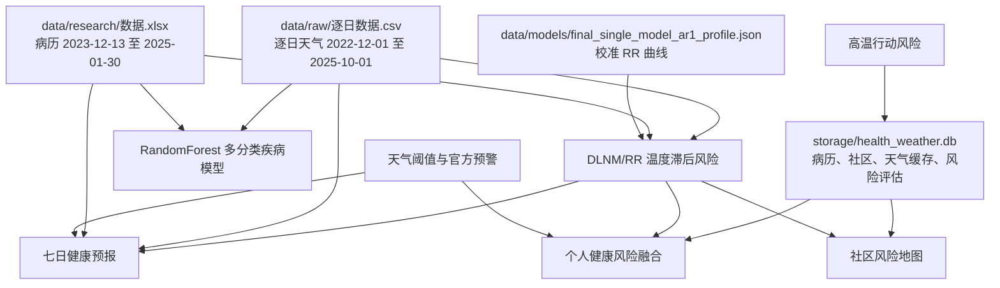

# 天气预警网站算法与数据清单（专家诊断版）

生成日期：2026-05-26  
范围：本报告基于本地仓库只读检查，覆盖当前能看到的数据文件、模型文件、训练脚本、在线服务与接口调用链路。  
目的：把“现有预测方法是什么、用了哪些原始数据、每条算法链路的输入输出是什么”整理成专家可诊断材料。

## 1. 结论摘要

当前系统并非单一模型驱动。它由 4 类能力叠加：

1. 机器学习疾病分类：`RandomForest` 多分类模型，基于病历人口学、就诊时间和天气特征预测疾病类别概率。
2. 温度健康风险：简化 DLNM/RR 风险曲线，当前优先加载外部校准 RR 曲线 `final_single_model_ar1_profile.json`。
3. 七日健康预报：用天气预报温度输入 DLNM/RR，再叠加季节基线、星期因子、不确定性和阈值，估算每日就诊量和预警等级。
4. 行动与人群风险规则：个人慢病风险、社区风险地图、热行动风险、官方天气预警和天气阈值规则共同形成页面展示与 API 输出。

当前最适合让专家优先判断的主问题：

1. 目标变量需要先定清楚：疾病类别、每日就诊量、超阈值风险、个人健康风险，还是社区行动优先级。
2. 现有 ML 分类模型的随机切分评估偏乐观风险较高，需要用时间切分或滚动验证重新评价。
3. 现有 DLNM/RR 与七日预报链路更贴近“预警”和“行动”，但当前实现混合了校准曲线、文献先验和规则权重，需要专家检查可解释性和校准质量。
4. 数据源时间范围存在错位：原始天气到 2025-10-01，原始病历到 2025-01-30，当前活跃 SQLite 的天气表主要是 2025-11 到 2026-01。

## 2. 原始数据与模型文件

### 2.1 天气原始数据

路径：`data/raw/逐日数据.csv`

本地检查结果：

| 项目 | 内容 |
| --- | --- |
| 行数 | 1036 |
| 列数 | 50 |
| 日期范围 | 2022-12-01 至 2025-10-01 |
| 地理字段 | `地名`, `经度`, `纬度` |
| 时间字段 | `日期` |
| 主要天气字段 | 平均气温、最低气温、最高气温、体感温度、降雨、风速、日照、湿度、露点温度 |
| 数据来源标识 | 多数字段带有“多源融合”或“IFS”字样 |
| 关键字段缺失 | 核心温度、降雨、风速、日照、湿度字段本次抽查为 0 缺失 |

核心统计：

| 字段 | 均值 | 最小值 | 最大值 |
| --- | ---: | ---: | ---: |
| 2米平均气温 | 17.266 | -4.930 | 33.130 |
| 2米最低气温 | 13.372 | -8.470 | 29.030 |
| 2米最高气温 | 21.732 | -0.620 | 38.730 |
| 2米平均体感温度 | 17.615 | -10.190 | 38.260 |
| 降雨量 | 4.999 | 0.000 | 137.200 |
| 10米平均风速 | 2.602 | 0.380 | 6.450 |
| 日照时数（秒） | 27298.704 | 0.000 | 46364.620 |
| 2米平均相对湿度 | 74.496 | 30.990 | 98.200 |

代码中常用重命名：

| 原始列 | 模型内字段 |
| --- | --- |
| `2米平均气温 (多源融合)(°C)` | `tmean` |
| `2米最低气温 (多源融合)(°C)` | `tmin` |
| `2米最高气温 (多源融合)(°C)` | `tmax` |
| `2米平均体感温度 (多源融合)(°C)` | `feels_like` |
| `2米平均相对湿度 (多源融合)(%)` | `humidity` |
| `10米平均风速 (多源融合)(m/s)` | `wind_speed` |
| `降雨量 (多源融合)(mm)` | `precipitation` |
| `日照时数 (多源融合)(s)` | `sunshine_hours` |

当前用途：

1. 训练多分类疾病预测模型。
2. DLNM/RR 风险函数加载和本地拟合。
3. 七日预报服务估计历史温度分布、日就诊阈值和季节基线。
4. 天气数据同步脚本写入 SQLite。

### 2.2 病历原始数据

路径：`data/research/数据.xlsx`

本地检查结果：

| 项目 | 内容 |
| --- | --- |
| 行数 | 2258 |
| 列数 | 15 |
| 就诊时间范围 | 2023-12-13 16:42:23 至 2025-01-30 14:11:01 |
| 主要字段 | 序号、医保、姓名、性别、年龄、就诊时间、科室、医生、疾病分类、主诉、病历描述、体温、心率、血压 |
| 科室分布 | 全科 2070，药房 188 |
| 性别分布 | 女性 1411，男性 847 |

疾病分类前几项：

| 疾病分类 | 数量 |
| --- | ---: |
| 上呼吸道疾病 | 1473 |
| 支气管炎 | 275 |
| 慢性胃炎 | 156 |
| 肺气肿 | 50 |
| 高血压 | 48 |
| 胃肠炎 | 37 |
| 泌尿系统疾患 | 20 |
| 痛风石 | 20 |
| 泌尿系结石 | 17 |
| 慢性胃窦炎 | 14 |

主要缺失：

| 字段 | 缺失数 |
| --- | ---: |
| 疾病分类 | 38 |
| 主诉 | 679 |
| 病历描述 | 679 |
| 列11 | 2190 |
| 体温 | 683 |
| 心率 | 838 |
| 血压 | 838 |

当前用途：

1. 训练疾病分类模型。
2. 聚合每日就诊量，用于 DLNM/RR 的本地数据部分。
3. 计算每日就诊阈值，例如 P75、P90、均值、标准差和历史最大值。
4. 作为 SQLite `medical_records` 的主要来源。

隐私注意：

病历原始 Excel 含姓名、医保、医生等个人或敏感字段。专家诊断算法时建议只提供去标识化版本，保留年龄、性别、就诊日期、疾病分类、社区、必要生命体征和聚合统计。

### 2.3 机器学习模型文件

路径：

1. `models/disease_predictor.pkl`
2. `models/scaler.pkl`
3. `models/label_encoder.pkl`
4. `models/feature_config.json`

`feature_config.json` 显示当前模型：

| 项目 | 内容 |
| --- | --- |
| 模型名 | RandomForest |
| 模型类型 | multiclass |
| 准确率 | 0.6526806526806527 |
| F1 | 0.6417731832945053 |
| 描述 | 多分类疾病预测模型，包含天气因素 |

特征列：

1. `年龄数值`
2. `性别编码`
3. `月份`
4. `季节`
5. `年龄段`
6. `星期`
7. `小时`
8. `tmean`
9. `tmin`
10. `tmax`
11. `feels_like`
12. `humidity`
13. `wind_speed`
14. `precipitation`
15. `sunshine_hours`

疾病类别：

1. 上呼吸道疾病
2. 下肢皮肤感染
3. 急性支气管炎
4. 慢性胃炎
5. 慢性胃窦炎
6. 支气管炎
7. 泌尿系结石
8. 泌尿系统疾患
9. 痛风石
10. 肺气肿
11. 胃肠炎
12. 阻塞性肺气肿
13. 高血压

特征重要性前几项：

| 特征 | 重要性 |
| --- | ---: |
| 年龄数值 | 0.155222 |
| tmin | 0.083153 |
| 月份 | 0.080340 |
| tmean | 0.079044 |
| feels_like | 0.071652 |
| humidity | 0.069789 |
| tmax | 0.067577 |
| 小时 | 0.065901 |
| sunshine_hours | 0.057136 |
| 年龄段 | 0.051959 |

本次限制：

本地当前 Python 环境缺少 `joblib`，仓库内 `venv/bin/python` 是 Linux ELF，macOS 上无法直接运行。因此本次没有直接反序列化 `.pkl` 文件。当前判断来自 `feature_config.json`、训练脚本和在线服务代码。

### 2.4 DLNM 外部校准曲线

路径：`data/models/final_single_model_ar1_profile.json`

本地检查结果：

| 项目 | 内容 |
| --- | --- |
| 名称 | final_single_model_ar1 |
| 版本 | 2026-02-11 |
| 描述 | 稳定性优先的校准单模型 RR 曲线 |
| MMT | 23.8 |
| 最大滞后 | 7 |
| 寒冷最大滞后 | 14 |
| 单日 RR 上限 | 2.6 |
| 累积 RR 上限 | 3.5 |
| 温度范围 | -3.0 至 33.0 |
| 曲线点数 | 361 |
| RR 范围 | 0.34809903 至 2.42361952 |

当前用途：

`services/dlnm_risk_service.py` 默认优先加载这个 profile。加载成功后，温度到 RR 的映射主要来自该曲线插值，再叠加滞后、疾病和年龄修正。

需要专家重点检查：

1. 低温端 RR 小于 1 的含义，需要结合源模型、基准温度和结局定义确认。
2. MMT 23.8 是否适合都昌本地和当前数据期。
3. 单日与累积 RR 上限是否会压低极端天气风险。

### 2.5 SQLite 数据库

配置逻辑：`core/config.py` 在没有 `DATABASE_URI` 时，优先使用 `storage/health_weather.db`，存在性次序如下：

1. `storage/health_weather.db`
2. `instance/health_weather.db`
3. `sqlite:///health_weather.db`

当前本地更像活跃库的是：`storage/health_weather.db`

主要表与行数：

| 表 | 行数 |
| --- | ---: |
| users | 3 |
| communities | 16 |
| medical_records | 2258 |
| weather_data | 115 |
| weather_cache | 1 |
| forecast_cache | 0 |
| health_risk_assessments | 12 |
| weather_alerts | 1 |
| family_members | 1 |
| family_member_profiles | 1 |
| health_diary | 0 |
| medication_reminders | 0 |
| notifications | 0 |
| audit_logs | 0 |

关键范围：

| 表 | 范围 |
| --- | --- |
| medical_records | 2023-12-13 16:42:23 至 2025-01-30 14:11:01 |
| weather_data | 2025-11-25 至 2026-01-14 |
| health_risk_assessments | 2025-10-21 至 2025-12-01 |
| weather_alerts | 2026-01-14 一条 |

另一个库：`instance/health_weather.db`

该库包含更多试点行动相关表，例如 `pairs`、`daily_status`、`community_daily`、`cooling_resources`、`debriefs`、`usage_events`、`alert_deliveries`。本地行数很少，`medical_records` 为 0，`weather_data` 为 5，天气范围是 2026-03-28 至 2026-04-27。

## 3. 算法清单

| 编号 | 算法或服务 | 文件 | 当前状态 | 核心用途 |
| --- | --- | --- | --- | --- |
| A1 | RandomForest 多分类疾病预测 | `services/ml_prediction_service.py` | 活跃 | 预测个人疾病类别概率和 ML 风险等级 |
| A2 | DLNM/RR 温度滞后风险 | `services/dlnm_risk_service.py` | 活跃 | 计算温度相关相对风险 RR |
| A3 | 七日健康预报 | `services/forecast_service.py` | 活跃 | 预测未来 7 天就诊量、超阈值概率和预警等级 |
| A4 | 个人慢病风险 | `services/chronic_risk_service.py` | 活跃 | 慢病、年龄、生命体征与天气风险综合评估 |
| A5 | 个人健康风险融合 | `services/health_risk_service.py` | 活跃 | 融合 DLNM、规则暴露、社区脆弱性和慢病风险 |
| A6 | 社区风险地图 | `services/community_risk_service.py` | 活跃 | 社区级风险、脆弱性、热点和行动优先级 |
| A7 | 高温行动风险 | `services/heat_action_service.py` | 活跃 | 根据热指数、夜间低温、连续高温给行动等级 |
| A8 | 天气阈值预警 | `services/weather_service.py` | 活跃 | 极端天气识别、天气预警等级、天气预报融合 |
| A9 | 官方预警接入 | `services/warning_service.py` | 活跃 | 接入和风天气官方预警并转换 CAP 风格字段 |
| A10 | 旧版疾病趋势预测 | `services/prediction_service.py` | 弃用 | 移动平均、季节因子、暴发风险规则 |
| A11 | 旧版数据驱动预测 | `services/data_driven_prediction.py` | 弃用 | 按月份、年龄、社区统计疾病分布和风险 |
| A12 | 离线训练脚本 | `services/pipelines/*.py` | 离线 | 训练 RF、二分类、三分类、XGBoost 等候选模型 |

## 4. 在线算法细节

### A1. RandomForest 多分类疾病预测

主要文件：

1. `services/ml_prediction_service.py`
2. `services/pipelines/train_multiclass_model.py`
3. `models/feature_config.json`

训练数据：

1. 病历 Excel：`data/research/数据.xlsx`
2. 天气 CSV：`data/raw/逐日数据.csv`

训练流程：

1. 读取病历，设定字段名。
2. 清洗年龄，把“岁”等文字转成数值。
3. 从就诊时间提取日期、月份、季节、星期、小时。
4. 编码性别。
5. 读取天气 CSV，把关键气象列重命名为 `tmean`、`tmin`、`tmax` 等。
6. 按就诊日期把病历和天气数据合并。
7. 保留样本数至少 10 的疾病分类。
8. 使用 `StandardScaler` 标准化特征。
9. 用 `LabelEncoder` 编码疾病类别。
10. 用 `train_test_split(test_size=0.2, random_state=42, stratify=y)` 随机分层切分。
11. 训练 `RandomForestClassifier`。

模型参数：

```text
n_estimators=200
max_depth=15
min_samples_split=5
min_samples_leaf=2
random_state=42
n_jobs=-1
class_weight='balanced'
```

在线预测输入：

| 输入 | 示例字段 |
| --- | --- |
| 用户信息 | 年龄、性别 |
| 天气信息 | temperature、humidity、wind_speed、precipitation、feels_like、sunshine_hours、AQI |
| 时间信息 | 当前月份、季节、星期、小时 |

在线输出：

1. 各疾病类别概率。
2. Top 疾病。
3. 经过天气敏感性规则修正后的风险。
4. 风险分数和风险等级：低风险、中风险、高风险。
5. 建议与风险因素说明。

额外规则：

模型概率输出之后，服务会对不同疾病应用天气敏感性因子。例如：

| 疾病 | 天气敏感因子 |
| --- | --- |
| 上呼吸道疾病 | 低温、高湿、低湿 |
| 支气管炎 | 低温、高湿 |
| 肺气肿 | 低温、低湿 |
| 高血压 | 低温、高温、温差 |
| 胃肠炎 | 高温、高湿 |
| 慢性胃炎 | 高温、压力因子 |
| 心血管疾病 | 低温、高温、温差 |

优点：

1. 能直接使用个人信息和天气信息，输出疾病分类概率。
2. 随机森林对非线性和特征交互有一定表达能力。
3. 训练和部署成本低，便于快速迭代。

主要风险：

1. 原始疾病分布极不均衡，上呼吸道疾病占比很高。
2. 随机切分会让相邻日期、同季节样本同时进入训练和测试，时间外推能力可能被高估。
3. 模型目标是“疾病分类”，和预警常用目标“就诊量超阈值”或“高风险事件”不同。
4. 当前在线输出叠加了人工规则，模型概率和规则分数边界需要重新校准。

专家应重点诊断：

1. 继续做疾病多分类是否服务于预警目标。
2. 是否改成每日就诊量、呼吸道就诊量、慢病急性加重等更明确的目标。
3. 是否需要时间切分、按月份滚动验证和按极端天气日单独评估。

### A2. DLNM/RR 温度滞后风险

主要文件：`services/dlnm_risk_service.py`

数据来源：

1. `data/raw/逐日数据.csv`
2. `data/research/数据.xlsx`
3. `data/models/final_single_model_ar1_profile.json`
4. 代码内置文献先验和默认参数

核心思想：

DLNM 表示分布式滞后非线性模型，用于表达温度对健康结局的非线性影响，以及这种影响在之后若干天内的滞后效应。当前实现是 Python 服务化版本，包含本地数据拟合、文献先验和外部校准曲线三层。

当前默认路径：

1. 初始化服务。
2. 如果 `DLNM_USE_PROFILE` 开启或未显式关闭，加载 `final_single_model_ar1_profile.json`。
3. 使用 profile 的温度到 RR 曲线做插值。
4. 对滞后温度、疾病类型、年龄做修正。
5. 输出单日或累积相对风险。

关键参数：

| 参数 | 当前值或来源 |
| --- | --- |
| MMT | profile 中为 23.8 |
| 最大滞后 | 7 |
| 寒冷最大滞后 | 14 |
| 单日 RR 上限 | 2.6 |
| 累积 RR 上限 | 3.5 |
| 文献权重 | 0.5 |
| 本地温度范围 | 从天气 CSV 估计 |

内部能力：

1. 加载天气和病历。
2. 按日期聚合每日就诊数。
3. 构造滞后温度特征。
4. 估计本地最小风险温度 MMT。
5. 生成温度滞后风险面。
6. 识别高温、低温、热夜、热浪和寒潮事件。

在线输入：

1. 当前温度。
2. 滞后温度列表。
3. 疾病类型。
4. 年龄。

在线输出：

1. RR。
2. 基础 RR。
3. 滞后修正。
4. 年龄修正。
5. 疾病修正。
6. 事件识别信息。

优点：

1. 与天气健康预警目标更接近，尤其适合温度和滞后效应。
2. 可解释性较强，专家容易审阅曲线、MMT、滞后窗口和 RR。
3. 能服务每日就诊量、慢病风险和社区风险多个模块。

主要风险：

1. 当前实现是混合工程模型，包含外部曲线、本地估计、文献先验和规则修正。
2. 低温端曲线含义需要结合源模型核对。
3. 如果新数据覆盖 2025 至 2026，需要重新校准 MMT、滞后窗口和 RR 上限。
4. 若结局定义是“所有就诊量”，呼吸道、心血管、胃肠等不同疾病会被混合。

专家应重点诊断：

1. 使用分疾病 DLNM、总就诊量 DLNM，还是分层 GAM/负二项模型。
2. 高温和低温是否需要不同滞后窗口。
3. profile 的来源、建模公式、过度离散处理和残差自相关处理是否充分。

### A3. 七日健康预报

主要文件：`services/forecast_service.py`

输入：

1. 未来 7 天天气预报，优先来自和风天气，也可由 API 直接传入 `forecast_temps`。
2. 历史天气 CSV。
3. 历史病历 Excel。
4. DLNM/RR 服务。
5. 预报上下文，如 AQI、湿度、最低温、模型离散度。

核心流程：

1. 加载历史天气，建立温度范围和历史分布。
2. 加载历史病历，聚合每日就诊量。
3. 计算每日就诊阈值：P75、P90、均值、标准差、最大值。
4. 对未来温度做简化校正和不确定性估计。
5. 调用 DLNM/RR 计算温度风险。
6. 用季节基线和星期因子估计每日就诊量。
7. 用近似负二项或正态近似估计超 P90 概率。
8. 根据超阈值概率输出预警等级。

风险等级逻辑：

| 条件 | 输出 |
| --- | --- |
| `prob_high > 0.5` | 红色预警 |
| `prob_high > 0.3` | 橙色预警 |
| `prob_high > 0.15` | 黄色提醒 |
| 其他 | 正常 |

额外暴露综合风险：

1. 高温。
2. PM2.5 或 AQI 代理。
3. 湿度。
4. 热夜。
5. 多暴露协同加分。

输出：

1. 未来 7 天每日预测就诊量。
2. 置信区间或不确定性范围。
3. 超阈值概率。
4. 风险等级。
5. CAP 风格语义字段。
6. 面向居民、照护者和社区工作者的行动卡片。

优点：

1. 更贴近“预警”场景，因为它直接输出未来日期的就诊压力和等级。
2. 能接入真实天气预报，并把温度风险转成行动语言。
3. 可通过 2025 至 2026 的新增数据做回测。

主要风险：

1. 当前所谓 quantile mapping 实现较简化，主要是提前期偏差修正和范围裁剪。
2. 预报误差、模型离散度、就诊量分布的不确定性需要系统校准。
3. 每日就诊量历史只有一个村镇或一个数据源时，外推到社区级需要谨慎。
4. 预警阈值目前是经验阈值，需用命中率、漏报率、提前量和行动成本共同优化。

专家应重点诊断：

1. 是否改成概率预测任务，例如未来 1 至 7 天是否超过 P90。
2. 是否用负二项回归、GAM、DLNM-GAM、XGBoost 或 LightGBM 做基准对比。
3. 是否分别评估 1 天、3 天、7 天提前期。

### A4. 个人慢病风险

主要文件：`services/chronic_risk_service.py`

输入：

1. 用户年龄、性别。
2. 慢病列表。
3. 生命体征，如血压、心率、体温。
4. 当前和未来天气。
5. DLNM/RR 温度风险。

方法：

1. 调用 DLNM 计算不同疾病类型的温度 RR。
2. 根据年龄段放大风险。
3. 根据慢病共病放大风险。
4. 根据生命体征异常做调整。
5. 输出综合风险等级和建议。

共病规则覆盖：

1. 高血压。
2. 糖尿病。
3. 冠心病。
4. COPD 或慢阻肺。
5. 哮喘。
6. 慢性支气管炎。
7. 心力衰竭。
8. 脑卒中史。
9. 肾病。
10. 关节炎。

优点：

1. 适合面向老人和慢病人群的解释型提醒。
2. 能把同样天气转化为个体差异化风险。

主要风险：

1. 大部分权重是规则或专家经验，缺少本地标签验证。
2. 当前病历缺少完整连续随访，慢病结局不容易直接校准。

专家应重点诊断：

1. 个体风险是否只作为行动优先级，还是要做医学预测。
2. 慢病字段来源是否稳定，是否需要问卷或家庭档案补齐。

### A5. 个人健康风险融合

主要文件：`services/health_risk_service.py`

输入：

1. 当前天气和预报。
2. 用户档案。
3. 社区信息。
4. 近期社区负担。
5. 慢病风险服务输出。

融合路径：

| 路径 | 内容 | 权重 |
| --- | --- | ---: |
| A | DLNM 温度风险 + 年龄/慢病敏感性 + AQI | 0.45 |
| B | 规则暴露模型，包括极端天气、AQI、湿度和筛查规则 | 0.30 |
| C | 社区脆弱性 + 近期社区负担 + 易感性 + 温度风险 | 0.25 |

最终合成：

1. 三路径加权融合。
2. 再与慢病综合分做二次融合，权重约为 0.85 和 0.15。
3. 输出风险分数、等级、概率、区间、CAP 语义、影响-可能性矩阵和方法说明。

优点：

1. 覆盖个人、天气、社区三层风险。
2. 输出结构适合前端展示和行动建议。

主要风险：

1. 权重目前偏工程设定，需要用历史数据回测。
2. 多个模型和规则会重复计入同一风险来源，例如高温可能在 DLNM、暴露规则和社区路径中同时影响分数。

专家应重点诊断：

1. 是否需要层级贝叶斯或校准后的 stacking 来替代固定权重。
2. 是否应把输出定位为“行动分层”而非临床风险。

### A6. 社区风险地图

主要文件：`services/community_risk_service.py`

输入：

1. 社区人口结构。
2. 慢病比例。
3. 绿地比例。
4. 热岛指数。
5. 医疗可及性。
6. 天气 RR。
7. 近期病例负担。

基础脆弱性权重：

| 指标 | 权重 |
| --- | ---: |
| elderly_ratio | 1.5 |
| chronic_disease_ratio | 1.8 |
| green_space_ratio | -0.8 |
| heat_island_index | 0.5 |
| medical_accessibility | -0.3 |

基础风险计算：

```text
RiskScore = weather_rr * VI * baseline_rate
normalized_excess = (1 - exp(-excess / efold)) * 100
```

风险阈值：

| 分数 | 等级 |
| --- | --- |
| >= 75 | 高 |
| >= 45 | 中 |
| 其他 | 低 |

高级风险地图：

1. DLNM 宏观天气 RR。
2. SIR 和置信区间。
3. 经验贝叶斯平滑。
4. SVI 风格脆弱性指数。
5. 风险指数：0.45 hazard + 0.35 SVI + 0.20 burden，再加不确定性惩罚。
6. HeatRisk 0 至 4 级。
7. Getis-Ord Gi* 风格热点识别。
8. 公平性分层和行动优先级。

优点：

1. 适合社区治理和资源调度。
2. 能把同一天的天气风险映射到不同社区差异。

主要风险：

1. 社区层指标是否真实、稳定、可更新，需要核验。
2. 社区病例数可能稀疏，空间统计结果容易不稳定。
3. 现有权重需要本地历史行动和健康结局验证。

专家应重点诊断：

1. 社区风险地图是否应该使用贝叶斯小区域模型。
2. 是否需要将模型输出绑定到实际可执行资源，例如探访、电话、降温点开放。

### A7. 高温行动风险

主要文件：`services/heat_action_service.py`

输入：

1. 热指数。
2. 夜间最低温。
3. 连续高温天数。

权重：

| 指标 | 权重 |
| --- | ---: |
| heat_index | 0.5 |
| night_min | 0.3 |
| hot_streak | 0.2 |

等级：

| 分数 | 等级 |
| --- | --- |
| >= 75 | extreme |
| >= 55 | high |
| >= 35 | medium |
| 其他 | low |

优点：

1. 简单直接，适合行动触发。
2. 对热夜和连续高温有明确响应。

主要风险：

1. 只覆盖高温行动，不覆盖低温、空气污染和复合暴露。
2. 权重和阈值需要结合本地行动成本与历史健康结局校准。

### A8. 天气阈值预警与天气预报融合

主要文件：`services/weather_service.py`

天气数据来源：

1. 和风天气 API。
2. Open-Meteo 备用。
3. Mock 降级数据。

极端天气识别阈值：

| 条件 | 事件 |
| --- | --- |
| temperature > 35 | 高温 |
| temperature < -10 | 低温 |
| temp_diff > 15 | 大温差 |
| humidity > 85 | 高湿 |
| wind_speed > 10 | 大风 |
| AQI > 100/150/200 | 空气质量分级风险 |

预报融合：

1. 读取和风天气 7 日预报。
2. 读取 Open-Meteo 7 日预报。
3. 对同一天做多模型融合，输出均值、范围、离散度和可预报性分数。
4. 若融合失败，依次使用和风、Open-Meteo、Mock。

优点：

1. 提升天气数据可用性。
2. 能给七日健康预报提供模型离散度和不确定性参考。

主要风险：

1. Mock 数据进入预警链路会影响可信度，所以综合预警接口已倾向只用和风天气。
2. 多模型融合方式仍是工程融合，未做严格预报误差校准。

### A9. 官方预警接入

主要文件：`services/warning_service.py`

输入：

1. 和风天气 `/warning/now`。
2. 城市或 location。

输出：

1. 官方预警标题。
2. 类型。
3. 等级。
4. 严重性 severity。
5. certainty。
6. urgency。
7. 生效时间、结束时间和文本。

优点：

1. 官方预警可作为最高可信触发信号。
2. 适合和自研健康风险形成双轨展示。

主要风险：

1. 官方预警覆盖气象灾害，不直接等于健康风险。
2. API 不可用时返回空，需要前端明确区分“无预警”和“暂未取到”。

## 5. 离线训练脚本

### 5.1 `train_multiclass_model.py`

当前生产模型最可能来自该脚本。

目标：

预测 13 个疾病分类。

模型：

`RandomForestClassifier`

特征：

人口学、时间、天气三类特征共 15 个。

评估：

随机分层 8:2 切分，准确率约 0.653，F1 约 0.642。

### 5.2 `train_binary_model.py`

目标：

呼吸道疾病 vs 非呼吸道疾病。

呼吸道判定：

疾病字符串包含“呼吸”“支气管”“肺”“咳”等关键词。

特征：

人口学和时间特征，未纳入天气特征。

候选模型：

1. RandomForest。
2. GradientBoosting。
3. ExtraTrees。
4. AdaBoost。
5. Soft Voting 集成。

适合用途：

如果专家认为“呼吸道高风险”比 13 类疾病更适合预警，这个脚本可作为旧候选基线。

### 5.3 `train_real_model.py`

目标：

把原始疾病合并成较大类别后预测。

特征：

人口学和时间特征。

候选模型：

1. RandomForest。
2. GradientBoosting。
3. LogisticRegression。

特点：

如果最佳模型是 RandomForest，会进行网格搜索调参。

### 5.4 `train_optimized_model.py`

目标：

三分类：呼吸系统、消化系统、其他。

额外特征：

1. 是否周末。
2. 年龄平方。
3. 是否老年。
4. 是否儿童。
5. 时段。

候选方法：

1. 优化版 RandomForest。
2. GradientBoosting。
3. Soft Voting 集成。
4. 尝试 SMOTE 处理类别不平衡。

注意：

脚本标题追求高准确率，但专家评估时应重点看时间外推、类别校准和高风险日识别能力。

### 5.5 `train_xgboost_model.py`

目标：

三分类：呼吸系统、消化系统、其他。

模型：

`XGBClassifier`

主要参数：

```text
n_estimators=500
max_depth=8
learning_rate=0.05
subsample=0.8
colsample_bytree=0.8
reg_alpha=0.1
reg_lambda=1.0
eval_metric='mlogloss'
```

适合用途：

作为树模型强基线，尤其适合和 RandomForest、GAM、负二项模型对比。

## 6. 已弃用算法

### 6.1 `services/prediction_service.py`

状态：

文件标注为 deprecated，当前应避免作为主算法依据。

方法：

1. 简单移动平均。
2. 季节因子。
3. 天气阈值和社区脆弱性规则。

问题：

方法太粗，适合作为历史参考或最低基线。

### 6.2 `services/data_driven_prediction.py`

状态：

文件标注为 deprecated，当前应避免作为主算法依据。

方法：

1. 按月份统计疾病分布。
2. 按年龄统计风险。
3. 按社区统计风险。
4. 用启发式天气关联生成健康预警。

问题：

没有形成严格可验证的预测模型，适合作为探索性统计参考。

## 7. 当前接口与页面调用

主要在线入口：

| 入口 | 调用服务 | 用途 |
| --- | --- | --- |
| `/ml-prediction` | `MLPredictionService.predict_disease_risk` | 页面上的 ML 疾病预测 |
| `/forecast-7day` | `ForecastService.generate_7day_forecast` | 七日健康预报 |
| `/chronic-risk` | `ChronicRiskService.predict_individual_risk` | 慢病个体风险 |
| `/api/v1/ml/predict` | ML 服务 | API 疾病预测 |
| `/api/v1/ml/predict-community` | ML 服务 | API 社区模拟风险 |
| `/api/v1/dlnm/risk` | DLNM 服务 | API 温度 RR |
| `/api/v1/dlnm/summary` | DLNM 服务 | API 模型摘要 |
| `/api/v1/forecast/7day` | Forecast 服务 | API 七日预报 |
| `/api/v1/forecast/daily` | Forecast 服务 | API 单日预报 |
| `/api/v1/community/risk-map-v2` | CommunityRiskService | API 社区风险地图 |
| `/api/v1/chronic/individual` | ChronicRiskService | API 个体慢病风险 |
| `/api/v1/alert/comprehensive` | Forecast + Weather | API 综合预警 |

## 8. 数据到算法的关系图



## 9. 专家诊断时建议比较的方向

这里列出候选方向及优缺点，便于专家开会时快速定路线。

### 方案 1：保留当前 DLNM/RR + 规则融合，重点做校准

优点：

1. 对温度健康风险可解释。
2. 与预警场景匹配度高。
3. 改动小，可以快速接入 2025 至 2026 新数据回测。

缺点：

1. 规则权重多，需要严谨校准。
2. 如果病种结局混合，RR 解释会变弱。
3. 对非温度因素，例如湿度、AQI、降雨，表达能力有限。

适合：

目标是短期上线更稳的健康预警和社区行动建议。

### 方案 2：建立每日就诊量预测模型

候选模型：

1. 负二项回归。
2. Poisson GAM。
3. DLNM-GAM。
4. Prophet 或时间序列基线。

优点：

1. 目标直接对应“未来几天就诊压力”。
2. 可以输出置信区间和超阈值概率。
3. 医疗专家和公共卫生专家较容易解释。

缺点：

1. 需要连续、稳定、日期级结局数据。
2. 节假日、就诊习惯、数据录入变化会干扰趋势。
3. 单点数据量较小，模型复杂度要受控。

适合：

目标是预警“高就诊量日”或“呼吸道就诊高峰”。

### 方案 3：建立机器学习超阈值分类或概率模型

候选模型：

1. XGBoost。
2. LightGBM。
3. RandomForest。
4. Logistic Regression 基线。

目标示例：

1. 未来 1 天是否超过历史 P90。
2. 未来 3 天任一天是否超过 P90。
3. 呼吸道就诊量是否超过 P75 或 P90。

优点：

1. 可以纳入多种天气变量、滞后变量和交互。
2. 回测命中率、漏报率、AUC、Brier Score 比较直观。
3. 比疾病 13 分类更接近预警。

缺点：

1. 可解释性弱于 DLNM/GAM。
2. 小样本和类别不平衡时容易过拟合。
3. 需要概率校准，否则阈值决策会不稳。

适合：

目标是用 2025 至 2026 新数据快速筛出预测性能更强的方案。

### 方案 4：建立“两阶段预警到行动”模型

阶段一：

预测健康风险或高就诊量概率。

阶段二：

根据人群脆弱性、资源容量和行动成本，决定黄色、橙色、红色行动等级。

优点：

1. 把健康预测和行动决策分开，便于解释和调参。
2. 能明确控制漏报和误报成本。
3. 更适合社区治理场景。

缺点：

1. 需要定义行动结果，例如电话触达、上门探访、降温点使用、风险缓解。
2. 数据闭环要求更高。

适合：

目标是从网站工具升级为可运营的社区预警系统。

## 10. 已知问题与待核清单

### 10.1 数据层

1. 原始天气、原始病历、SQLite 天气表的时间范围不一致。
2. 病历疾病分类高度不均衡，上呼吸道疾病占主导。
3. 病历缺少完整主诉、病历描述、体温、心率、血压。
4. 社区维度在原始病历中是否完整，需要进一步核验。
5. 2025 至 2026 新数据需要明确格式、字段、来源和质量。

### 10.2 模型层

1. RandomForest 当前评估来自随机切分，需要时间切分重评估。
2. 当前 ML 目标是疾病类别，预警目标可能更适合就诊量或超阈值概率。
3. DLNM/RR profile 的源模型和低温端含义需要专家核验。
4. 七日健康预报的概率和预警阈值需要回测校准。
5. 融合模型固定权重可能重复计入天气风险。

### 10.3 工程层

1. `.pkl` 在本机未能直接加载验证，因为当前可用 Python 缺少 `joblib`，仓库 venv 不是 macOS 可执行环境。
2. 活跃数据库选择依赖文件存在性和环境变量，生产环境需确认真实 `DATABASE_URI`。
3. Mock 天气数据如果进入预警链路，会影响可信度，需要在展示层明确标记。
4. 旧版弃用服务仍在仓库中，专家材料需要标注活跃和弃用边界。

## 11. 给外部专家的问题清单

建议把以下问题连同数据字典发给专家：

1. 在这个项目里，首要预测目标应定义为疾病分类、每日就诊量、超阈值概率、个人风险，还是社区行动等级？
2. 如果目标是预警，建议使用总就诊量、呼吸道就诊量、慢病急性加重，还是多结局并行？
3. 对 2022 至 2026 的天气和病历数据，应该使用怎样的时间切分与滚动回测方案？
4. DLNM 的温度基准、MMT、滞后窗口和 RR 上限是否合理？
5. 是否需要分季节、分年龄、分疾病建立不同风险曲线？
6. 机器学习方案中，XGBoost/LightGBM 与 GAM/DLNM-GAM 哪个更适合本地小样本？
7. 预警等级阈值应该按统计阈值、健康影响、行动容量，还是误报漏报成本来确定？
8. 社区脆弱性权重应使用专家赋权、数据拟合，还是两者结合？
9. 2025 至 2026 新数据中，是否有真实预警、行动执行和健康结果反馈可以用来训练第二阶段行动模型？

## 12. 接入 2025 至 2026 新数据时需要的字段

为了让专家能准确判断算法路线，建议把新数据整理成以下几张表。

### 12.1 每日天气观测表

必要字段：

1. `date`
2. `location`
3. `tmean`
4. `tmin`
5. `tmax`
6. `feels_like`
7. `humidity`
8. `precipitation`
9. `wind_speed`
10. `sunshine_hours`
11. `aqi`
12. `pm25`
13. `data_source`

### 12.2 每日天气预报快照表

必要字段：

1. `issue_time`
2. `target_date`
3. `lead_day`
4. `location`
5. `forecast_tmin`
6. `forecast_tmax`
7. `forecast_tmean`
8. `forecast_humidity`
9. `forecast_precipitation`
10. `forecast_wind`
11. `provider`

用途：

评估真实预报误差，避免用事后观测替代历史预报。

### 12.3 每日就诊聚合表

必要字段：

1. `date`
2. `location`
3. `all_visits`
4. `respiratory_visits`
5. `cardiovascular_visits`
6. `digestive_visits`
7. `elderly_visits`
8. `child_visits`
9. `unique_patients`

可选字段：

1. 社区。
2. 年龄段。
3. 性别。
4. 慢病标签。
5. 是否急诊或转诊。

### 12.4 社区脆弱性表

必要字段：

1. `community_id`
2. `community_name`
3. `elderly_ratio`
4. `chronic_disease_ratio`
5. `living_alone_elderly_ratio`
6. `green_space_ratio`
7. `heat_island_index`
8. `medical_accessibility`
9. `cooling_resource_count`
10. `grid_worker_count`

### 12.5 预警和行动结果表

必要字段：

1. `date`
2. `community_id`
3. `warning_level`
4. `warning_source`
5. `action_triggered`
6. `calls_made`
7. `home_visits`
8. `cooling_resource_opened`
9. `high_risk_people_contacted`
10. `adverse_events`
11. `feedback`

用途：

训练或评估第二阶段“预警到行动”模型。

## 13. 建议下一步

1. 先把 2025 至 2026 新数据按第 12 节整理成标准表。
2. 用时间切分重新评估当前 RandomForest、DLNM/RR 七日预报和简单基线。
3. 至少建立 4 个对照基线：昨日值、季节均值、负二项/GAM、XGBoost 或 LightGBM。
4. 统一预警目标：建议优先从“未来 1 至 7 天呼吸道或总就诊量超 P90 的概率”开始。
5. 将个人和社区规则保留为行动层，先让健康预测层输出可校准概率。
6. 回测指标同时看 AUC、Brier Score、校准曲线、提前量、漏报率、误报率和行动负担。

